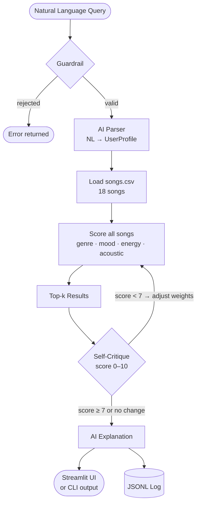

# 🎵 VibeFinder — AI Music Recommender

VibeFinder is a content-based music recommender extended with a Gemini-powered AI agent. Instead of typing genre tags into a form, you describe what you're in the mood for in plain English — "something calm and acoustic to study to at night" — and the system parses your intent, scores an 18-song catalog, critiques the quality of its own results, and explains why the songs fit.

**Why it matters:** Most production recommenders are black boxes. VibeFinder is the opposite: every score is traceable to the exact features that earned it, the AI explains its reasoning in plain language, and the system logs every decision to a structured file you can inspect. It shows how rule-based transparency and AI-powered flexibility can be layered together rather than treated as alternatives.


---

## Architecture Overview

VibeFinder has two cooperating layers:

**Layer 1 — Rule-based scoring engine** (`recommender.py`): A pure function that awards points to each song based on genre match, mood match, energy proximity, and acoustic preference. Fast, deterministic, and fully explainable. Every recommendation is backed by a numeric reason.

**Layer 2 — Gemini AI agent** (`ai_agent.py`): Wraps the scoring engine with four AI capabilities — a guardrail that rejects off-topic input, a natural language parser that converts conversational queries into structured profiles, a self-critique loop that scores the result quality and proposes weight adjustments if the match is poor, and a narrative explanation generator. All of this is logged to JSONL.

The key design insight is that neither layer is sufficient alone. The scoring engine can't understand "morning run energy" without a structured profile; the AI agent can't produce transparent, per-feature justifications without the scoring engine beneath it.



### Agentic loop, step by step

```
User query (natural language)
        ↓  [GUARDRAIL]    reject if not music-related
        ↓  [AI PARSE]     NL → structured UserProfile (JSON mode)
        ↓  [RECOMMEND]    score all songs with current weights
        ↓  [SELF-CRITIQUE] score 0–10, propose weight adjustments
        ↓  If score < 7 and weights changed → re-run (max 3×)
        ↓  [AI EXPLAIN]   generate narrative
        ↓  [LOG]          write JSONL entry
```

---

## How The System Works

### Phase 1–3: Rule-Based Scoring

Every song in the catalog is scored against a user's preferences across four dimensions:

| Signal | Points | Rationale |
| --- | --- | --- |
| Genre match | +2.0 | Broadest identity signal — users strongly identify by genre |
| Mood match | +1.0 | Contextual intent — "I want something chill right now" |
| Energy proximity | `(1 - abs(song.energy - target)) × 2.0` | Rewards closeness, not just high/low |
| Acoustic bonus | +1.0 if `likes_acoustic` and `acousticness > 0.6` | Optional texture preference |
| **Max possible** | **6.0** | |

### Phase 4: AI Agent Extensions

| Component | What it does |
| --- | --- |
| **Guardrail** | Rejects off-topic queries before they reach the recommender |
| **NL Parser** | Converts natural language into a structured `UserProfile` via Gemini JSON mode |
| **Self-Critique Loop** | Scores recommendation quality 0–10; if score < 7, proposes adjusted weights and re-runs (up to 3 iterations) |
| **Narrative Explanation** | Writes a 2–3 sentence friendly explanation of why the songs fit |
| **Structured Logger** | Appends every run to `logs/recommendations.jsonl` with confidence scores, iteration counts, and final weights |

### Song Features

| Feature | Type | Description |
| --- | --- | --- |
| `genre` | string | pop, lofi, rock, ambient, jazz, synthwave, indie pop, … |
| `mood` | string | happy, chill, intense, relaxed, focused, moody, … |
| `energy` | float 0–1 | intensity / activity level |
| `valence` | float 0–1 | musical positivity |
| `acousticness` | float 0–1 | organic vs. electronic texture |
| `tempo_bpm` | float | beats per minute |

### UserProfile

| Field | Type | Description |
| --- | --- | --- |
| `favorite_genre` | string | genre the user most identifies with |
| `favorite_mood` | string | emotional context they want right now |
| `target_energy` | float 0–1 | how intense or calm they want the music |
| `likes_acoustic` | bool | preference for organic/acoustic sounds |

---

## Project Structure

```
.
├── data/
│   └── songs.csv              # 18-song catalog
├── src/
│   ├── recommender.py         # Song/UserProfile dataclasses + scoring logic
│   ├── main.py                # CLI runner (rule-based, all profiles)
│   ├── ai_agent.py            # Gemini-powered agent (guardrail, parse, critique, explain)
│   ├── logger.py              # Structured JSONL logger
│   └── app.py                 # Streamlit UI
├── tests/
│   ├── test_recommender.py    # Tests for rule-based core
│   └── test_ai_agent.py       # Tests for AI agent (Gemini mocked)
├── .streamlit/
│   └── config.toml            # Warm parchment color theme
├── logs/                      # Auto-created; holds recommendations.jsonl
├── model_card.md
├── pytest.ini
└── requirements.txt
```

---

## Getting Started

### 1. Install dependencies

```bash
python -m venv venv
source venv/bin/activate        # Mac / Linux
venv\Scripts\activate           # Windows

pip install -r requirements.txt
```

### 2. Add your Gemini API key

```bash
cp .env.example .env
# edit .env and set GEMINI_API_KEY=your_key_here
```

Get a free key at [aistudio.google.com/app/apikey](https://aistudio.google.com/app/apikey).

### 3. Run the Streamlit app (AI mode)

```bash
streamlit run src/app.py
```

Enter your Gemini key in the sidebar, type what you're in the mood for, and get AI-powered recommendations with a confidence score and narrative explanation.

### 4. Run the CLI (rule-based mode, no API key needed)

```bash
python -m src.main
```

Runs all six user profiles (three typical, three adversarial) plus a weight-shift experiment and prints ranked results to the terminal.

### 5. Run tests

```bash
pytest tests/ -v
```

All 16 tests run without a real API key — Gemini calls are mocked.

---

## Sample Interactions

### Example 1: Morning run playlist

**Input:** `"something high energy and upbeat for my morning run, I like pop"`

**Parsed profile:**

```json
{ "favorite_genre": "pop", "favorite_mood": "happy", "target_energy": 0.85, "likes_acoustic": false }
```

**Top recommendations:**

| # | Title | Artist | Genre | Mood | Energy | Score |
| --- | --- | --- | --- | --- | --- | --- |
| 1 | Sunrise City | Neon Echo | pop | happy | 0.82 | 4.96 / 6 |
| 2 | Gym Hero | Max Pulse | pop | intense | 0.93 | 4.86 / 6 |
| 3 | Block Party Anthem | Crowd Surge | pop | energetic | 0.89 | 4.80 / 6 |

**AI Explanation:** These pop tracks bring exactly the bright, driving energy a morning run calls for. Sunrise City earns top spot with a perfect genre and mood match plus an energy level nearly identical to your target. Gym Hero and Block Party Anthem come in close behind — their high-energy pop sound keeps the pace even if the mood tag leans more intense than happy.

**Confidence:** 8.5 / 10 — 1 loop

---

### Example 2: Off-topic query (guardrail fires)

**Input:** `"what's a good recipe for chocolate chip cookies?"`

**System response:**

```
Query rejected: This request is about baking, not music preferences.
Please describe the kind of music you're in the mood for.
```

The guardrail catches the off-topic input before it ever reaches the parser or recommender. Nothing is logged as a recommendation; an error entry is written instead.

---

### Example 3: Sparse-catalog query triggering the self-critique loop

**Input:** `"really calm acoustic folk music, something melancholic and quiet"`

**Parsed profile:**

```json
{ "favorite_genre": "folk", "favorite_mood": "melancholic", "target_energy": 0.15, "likes_acoustic": true }
```

**Loop 1** — default weights (genre=2, energy×2):
The catalog has only one folk song, so the top result is correct but the rest fall back to acoustic songs from other genres. Self-critique scores this **5.5 / 10** — genre weight is too dominant for a sparse genre — and proposes raising the acoustic and energy weights.

**Loop 2** — adjusted weights (genre=1.5, energy×3, acoustic=1.5):
Hollow Road (folk, melancholic, 0.12) rises to #1 with a strong acoustic bonus. Library Rain and Spacewalk Thoughts, both highly acoustic and low-energy, fill the remaining slots more accurately. Self-critique scores this **8.0 / 10**.

**AI Explanation:** Since only one folk track is in the catalog, these picks lean on the shared qualities that matter most for a quiet, reflective session — very low energy, high acousticness, and a melancholic mood. Hollow Road is the closest match across all four dimensions; Library Rain and Spacewalk Thoughts fill in as organic, low-energy alternatives from adjacent genres.

**Confidence:** 8.0 / 10 — 2 loops

---

## Design Decisions

### Two layers instead of pure AI

The scoring engine could have been replaced entirely with a prompt like "rank these 18 songs for this user." The problem is that approach is a black box: no per-feature scores, no explainability, and no deterministic behavior. Keeping the rule-based engine as the core means every recommendation can be traced to exact point values. Gemini handles what it is genuinely better at — understanding natural language and generating narrative text — while the scoring engine handles what it is better at: fast, auditable, reproducible ranking.

### Gemini JSON mode for structured output

The NL parser and self-critique both need structured data back from the model (a `UserProfile` dict, a critique object with score and weight adjustments). Rather than parsing free-text responses with regex, both calls use `response_mime_type="application/json"`, which forces Gemini to return valid JSON. A regex-based fallback still exists for resilience, but JSON mode eliminated nearly all parse failures in practice.

### Self-critique loop capped at 3 iterations

The loop stops when the confidence score reaches 7 or higher, when the model proposes no weight change, or after 3 iterations — whichever comes first. The cap exists because each iteration is an extra API call with real latency and cost. In testing, most queries that needed adjustment converged in 2 loops; a third almost never changed the result meaningfully.

### JSONL for logging

Each log entry is a self-contained JSON object on its own line, making the log file both human-readable and machine-parseable with a single `json.loads()` per line. Appending never requires reading the whole file, and the format survives partial writes cleanly. A database would be overkill for a project of this scale.

### Weight-based scoring over cosine similarity

A vector similarity approach (embedding songs and profiles into a shared space) would scale better to a large catalog but adds a dependency on an embedding model and loses the per-feature explainability that makes this system educational. The weight table is intentionally simple so students can read the scoring formula and immediately understand why a song ranked where it did.

---

## Testing Summary

### Coverage

| Test file | Tests | What is covered |
| --- | --- | --- |
| `test_recommender.py` | 2 | Sorting correctness, explanation output |
| `test_ai_agent.py` | 14 | Guardrail, NL parser, explanation generator, self-critique, full agentic loop |
| **Total** | **16** | |

### Approach

All Gemini API calls are mocked with `unittest.mock`. This means the tests run in under 1 second with no API key and no network access. Each mock returns a pre-crafted response payload so the test can assert on the agent's behavior given a known model output — not on what Gemini happens to return on a given day.

### What worked well

- **Mocking JSON-mode responses** was straightforward: just return a `MagicMock` whose `.text` is a `json.dumps()` of the expected dict.
- **Testing the early-stop logic** in the agentic loop (when the model proposes the same weights, the loop should stop after one iteration) caught a real bug during development — the original loop checked `should_retry` but not whether the weights actually changed, so it would spin uselessly and burn API calls.
- **Testing fallback paths** (API errors, unparseable JSON) was the most valuable part. The agent has several `try/except` blocks that return safe defaults; without explicit tests for those paths, it would be easy to silently break them.

### What was tricky

- The `run_agentic_loop` routes to different Gemini responses depending on what's in the prompt (guardrail call vs. parse call vs. critique call). The mock `side_effect` function has to inspect the prompt text to return the right payload, which made the test setup verbose.
- Streamlit's UI layer is not covered by the unit tests. The behavior of `app.py` — rendering cards, displaying metrics, handling session state — was verified manually by running the app.

### Lessons learned

Testing the happy path first is not enough. The most useful bugs in this project were found by writing tests for the cases where something goes wrong: the API fails, the JSON is malformed, the model proposes no change. Those edge-case tests forced the fallback logic to be explicit rather than assumed.

---

## Experiments

### Default vs. shifted weights (High-Energy Pop profile)

| Weight config | #1 | #2 | Observation |
| --- | --- | --- | --- |
| genre=2, energy×2 | Sunrise City (pop, happy) | Gym Hero (pop, intense) | Genre bonus keeps both pop songs on top even though Gym Hero's mood is wrong |
| genre=1, energy×4 | Sunrise City (pop, happy) | Rooftop Lights (indie pop, happy) | Higher energy weight promotes Rooftop Lights (energy=0.76, closer to target 0.8) over Gym Hero (0.93, further away) |

### Adversarial: Classical + Energetic (energy=0.9)

Morning Sonata (classical, serene, energy=0.18) ranked #1 solely because of the genre match, beating songs with energy 0.91 and matching mood. This is the clearest demonstration of genre dominance. The AI self-critique catches this — it scores the result low and proposes a higher energy weight to correct it on the next iteration.

### Unknown genre: kpop

With no catalog matches, the system degrades gracefully to mood and energy. Rooftop Lights (indie pop, happy, energy=0.76) ranked first with 2.98/6 — a reasonable fallback showing the partial-credit energy formula still works when genre fails entirely.

---

## Known Biases and Limitations

- **Genre dominance** — a genre match is always worth the full 2.0 points, but energy proximity rarely reaches 2.0 in practice. This means a mediocre song in the right genre can outscore a nearly-perfect song in the wrong genre.
- **Mood vocabulary lock-in** — moods are exact string matches. "Energetic" and "intense" describe near-identical feelings but never match each other.
- **Catalog skew** — the catalog has 3 lofi songs but only 1 each of metal, blues, classical, etc. Genre diversity is uneven.
- **Cold-start assumption** — the rule-based path requires explicitly stated preferences; the AI parser mitigates this but maps unusual requests to the nearest available catalog genre, which may not reflect intent.
- **Small catalog** — 18 fictional songs is sufficient for learning but not for real music discovery.

---

## Reflection

### What this project taught about recommender systems

Building a scoring function from scratch made it obvious why real recommenders feel harder to explain than they are. The math — multiply a weight by a match, sum the weights, sort — is simple. What is hard is choosing the weights. Genre=2.0 and energy×2.0 seems reasonable until you run the "Classical + Energetic" adversarial case and realize the genre bonus effectively dominates in almost every real-world situation, because energy proximity almost never hits its maximum. The flaw is invisible in the formula and only visible in the output. That observation applies directly to production ML: a model can be correct on average and wrong in the cases that matter most, and you will not find those cases by reading the code.

### What this project taught about layering AI on top of rule-based systems

The AI agent additions in Phase 4 were most useful where the rule-based layer was genuinely incapable: understanding "I want something that feels like a Sunday morning" requires language understanding, not arithmetic. But they were least useful where the rule-based layer was already doing well: once the query is parsed into a profile, Gemini has no information the scoring function doesn't have. The self-critique loop adds value mainly in adversarial cases — sparse genres, conflicting preferences — where the default weights produce a result that looks obviously wrong. For straightforward queries it just confirms what the scorer already found. That is a real pattern in applied AI: adding AI to a system is most impactful at the edges, not the center.

### What I would do differently

The mood exact-match problem would be the first thing I'd fix. Grouping moods into semantic clusters ("intense" ↔ "energetic," "chill" ↔ "serene" ↔ "relaxed") and awarding partial credit for near-matches would make the system feel far more natural without changing the scoring architecture at all. Second, the catalog is too small to stress-test the system meaningfully — 100+ songs would reveal ranking failures that 18 songs simply can't expose. Both changes would require no new AI components, just better data and a slightly richer scoring rule.

See [model_card.md](model_card.md) for a full per-profile evaluation and bias analysis.
