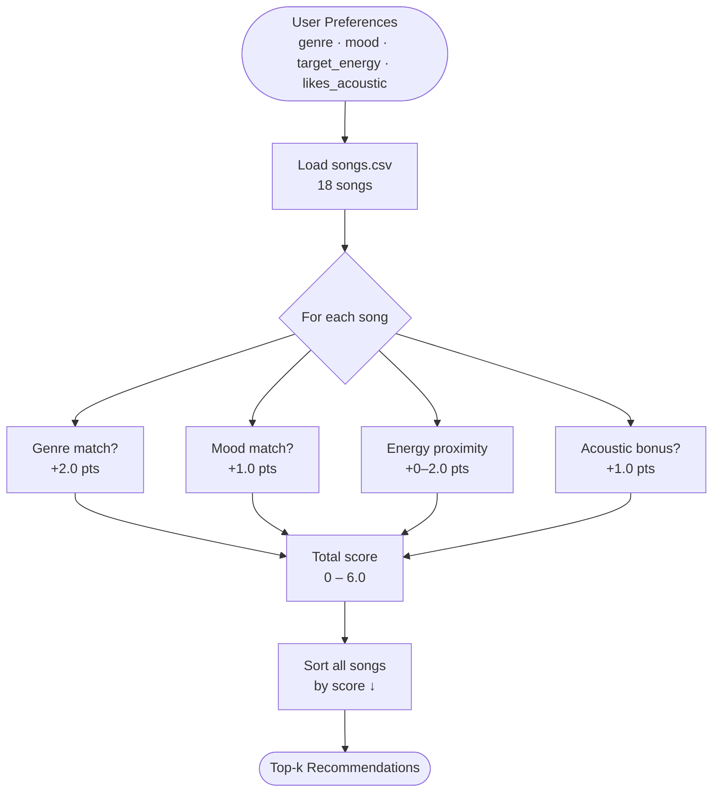
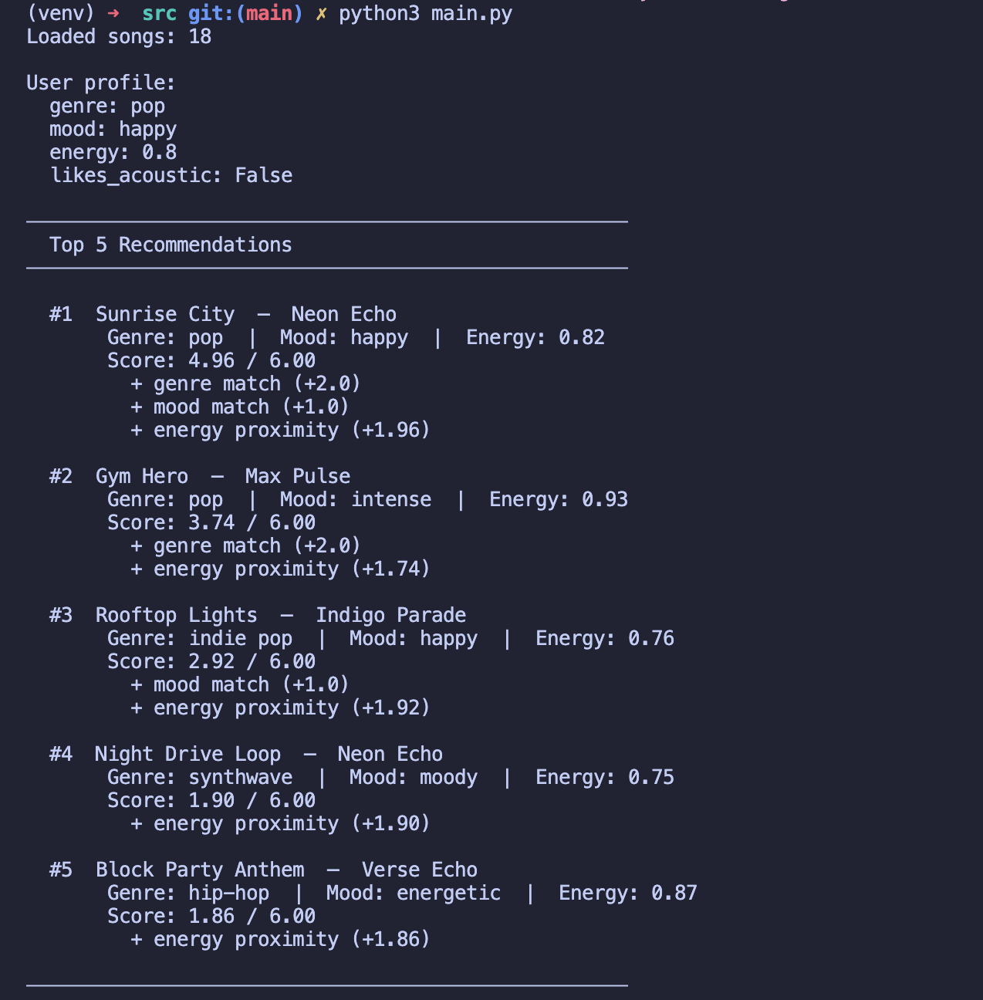

# 🎵 Music Recommender Simulation

## Project Summary

In this project you will build and explain a small music recommender system.

Your goal is to:

- Represent songs and a user "taste profile" as data
- Design a scoring rule that turns that data into recommendations
- Evaluate what your system gets right and wrong
- Reflect on how this mirrors real world AI recommenders

This version is a content-based recommender that scores every song in an 18-song catalog against a user's stated preferences — genre, mood, target energy level, and acoustic taste — then returns the top-k matches. It is designed to be transparent: every score is explainable by the exact features that contributed points, making it easy to trace why a specific song was (or was not) recommended.

---

## How The System Works

Real-world music recommenders like Spotify's Discover Weekly work by building a numeric profile of both a song's "signal" (its audio features) and a user's "taste" (inferred from listening history), then finding songs whose signals are closest to that taste profile. This simulation mirrors that approach on a small scale: instead of inferring preferences from history, the user explicitly states them, and the system scores each song in the catalog by how well its features match those stated preferences. The final recommendations are simply the top-k highest-scoring songs. This version prioritizes **genre and mood as the strongest signals of intent**, while using **energy proximity** to fine-tune within a category — reflecting the real experience that genre sets the room, mood sets the moment, and energy sets the pace.

### `Song` features used

- `genre` — categorical label (pop, lofi, rock, ambient, jazz, synthwave, indie pop)
- `mood` — categorical label (happy, chill, intense, relaxed, focused, moody)
- `energy` — float 0–1, intensity/activity level
- `valence` — float 0–1, musical positivity (uplifting vs. melancholic)
- `acousticness` — float 0–1, organic vs. electronic texture

### `UserProfile` stores

- `favorite_genre` — the genre the user most identifies with
- `favorite_mood` — the emotional context they want right now
- `target_energy` — a 0–1 float for how intense/calm they want the music
- `likes_acoustic` — boolean preference for organic/acoustic sounds

### Sample `UserProfile`

```python
user = UserProfile(
    favorite_genre  = "lofi",
    favorite_mood   = "chill",
    target_energy   = 0.40,   # prefers calm, low-intensity music
    likes_acoustic  = True,
)
```

This profile can differentiate "intense rock" (genre mismatch, mood mismatch, energy way off) from "chill lofi" (all four dimensions align) — it is not too narrow because `target_energy` is a continuous value that still gives partial credit to nearby songs.

---

### Algorithm Recipe (Scoring Rule)

| Signal | Points | Rationale |
| --- | --- | --- |
| Genre match | +2.0 | Broadest identity signal — users strongly identify by genre |
| Mood match | +1.0 | Contextual intent — "I want something chill right now" |
| Energy proximity | `(1 - abs(song.energy - target)) * 2.0` | Rewards closeness, not just high/low |
| Acoustic bonus | +1.0 if `likes_acoustic` and `acousticness > 0.6` | Optional texture preference |
| **Max possible** | **6.0** | |

```python
score  = 2.0  if song.genre == user.favorite_genre else 0
score += 1.0  if song.mood  == user.favorite_mood  else 0
score += (1.0 - abs(song.energy - user.target_energy)) * 2.0
score += 1.0  if user.likes_acoustic and song.acousticness > 0.6 else 0
```

### Choosing recommendations (Ranking Rule)

All songs are scored, sorted in descending order, and the top-k are returned. The **scoring rule** answers "how good is this one song?" (per-song, local). The **ranking rule** answers "which songs should I show?" (across all songs, global). You need both: scores without ranking give you a bag of numbers; ranking without scores gives you no basis for comparison.

---

### Data Flow



---

### Known Biases

- **Genre dominance** — a genre match is worth 2.0 fixed points, which means a mediocre song in the right genre can outscore a nearly-perfect song in the wrong genre. A lofi track with wrong mood and mismatched energy could still beat a jazz track with perfect mood and energy.
- **Cold-start assumption** — the profile is manually set. Users who don't know their `target_energy` precisely will get noisier results.
- **Catalog skew** — the 18-song catalog has 3 lofi songs but only 1 each of metal, blues, classical, etc. A lofi-preferring user gets more variety; a metal-preferring user has only one possible genre match.
- **Mood vocabulary lock-in** — moods are exact string matches. "Energetic" and "intense" both mean high-energy but will never match each other, even though they describe a similar experience.

---

## Getting Started

### Setup

1. Create a virtual environment (optional but recommended):

   ```bash
   python -m venv .venv
   source .venv/bin/activate      # Mac or Linux
   .venv\Scripts\activate         # Windows

2. Install dependencies

```bash
pip install -r requirements.txt
```

3. Run the app:

```bash
python -m src.main
```

### Running Tests

Run the starter tests with:

```bash
pytest
```

You can add more tests in `tests/test_recommender.py`.

---

## Experiments You Tried

Use this section to document the experiments you ran. For example:

- What happened when you changed the weight on genre from 2.0 to 0.5
- What happened when you added tempo or valence to the score
- How did your system behave for different types of users

---

## Limitations and Risks

Summarize some limitations of your recommender.

Examples:

- It only works on a tiny catalog
- It does not understand lyrics or language
- It might over favor one genre or mood

You will go deeper on this in your model card.

---

## Reflection

Read and complete `model_card.md`:

[**Model Card**](model_card.md)

Write 1 to 2 paragraphs here about what you learned:

- about how recommenders turn data into predictions
- about where bias or unfairness could show up in systems like this


---

## 7. `model_card_template.md`

Combines reflection and model card framing from the Module 3 guidance. :contentReference[oaicite:2]{index=2}  

```markdown
# 🎧 Model Card - Music Recommender Simulation

## 1. Model Name

Give your recommender a name, for example:

> VibeFinder 1.0

---

## 2. Intended Use

- What is this system trying to do
- Who is it for

Example:

> This model suggests 3 to 5 songs from a small catalog based on a user's preferred genre, mood, and energy level. It is for classroom exploration only, not for real users.

---

## 3. How It Works (Short Explanation)

Describe your scoring logic in plain language.

- What features of each song does it consider
- What information about the user does it use
- How does it turn those into a number

Try to avoid code in this section, treat it like an explanation to a non programmer.

---

## 4. Data

Describe your dataset.

- How many songs are in `data/songs.csv`
- Did you add or remove any songs
- What kinds of genres or moods are represented
- Whose taste does this data mostly reflect

---

## 5. Strengths

Where does your recommender work well

You can think about:
- Situations where the top results "felt right"
- Particular user profiles it served well
- Simplicity or transparency benefits

---

## 6. Limitations and Bias

Where does your recommender struggle

Some prompts:
- Does it ignore some genres or moods
- Does it treat all users as if they have the same taste shape
- Is it biased toward high energy or one genre by default
- How could this be unfair if used in a real product

---

## 7. Evaluation

How did you check your system

Examples:
- You tried multiple user profiles and wrote down whether the results matched your expectations
- You compared your simulation to what a real app like Spotify or YouTube tends to recommend
- You wrote tests for your scoring logic

You do not need a numeric metric, but if you used one, explain what it measures.

---

## 8. Future Work

If you had more time, how would you improve this recommender

Examples:

- Add support for multiple users and "group vibe" recommendations
- Balance diversity of songs instead of always picking the closest match
- Use more features, like tempo ranges or lyric themes

---

## 9. Personal Reflection

A few sentences about what you learned:

- What surprised you about how your system behaved
- How did building this change how you think about real music recommenders
- Where do you think human judgment still matters, even if the model seems "smart"



